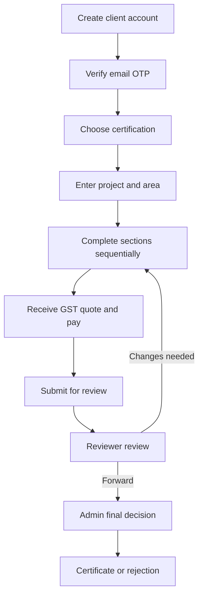
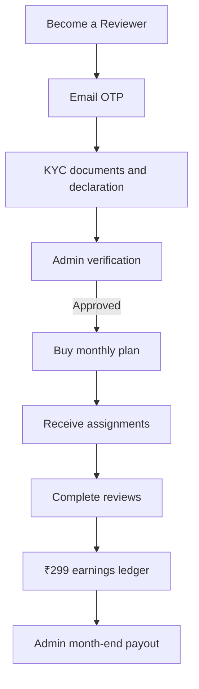

# ClimateWallah

ClimateWallah is a full-stack sustainability certification platform with a public website, CMS, client assessment workspace, professional reviewer marketplace, admin verification, online payments, earnings, and payouts.

> Assessment notice: portal results are internal/preliminary assessments. They are not an official IGBC, WELL, or LEED certification unless an authorised administrator issues the final record.

## What is included

### Public website and CMS

- Home, About, Services, Projects, Team, Events, Blog, Contact, and legal pages
- Tools including the GHG emissions calculator
- Book-a-demo and enquiry forms
- Admin-managed website content, images, documents, and capability PDF
- Responsive SaaS visual system using `#27F580`, `#172033`, white, and neutral greys

### Client portal

- Account creation with a six-digit email OTP valid for five minutes
- Project creation for Commercial, Residential, Hotel, and Hospital
- Certification selection before project details: IGBC, WELL, LEED, or another admin-created type
- Building details, area, geo-location, project team, privacy, and media
- Sequential assessment sections; the next section unlocks only after the current mandatory requirements are complete
- Evidence uploads stored in MongoDB GridFS
- Area-based review quote, 18% GST, Razorpay Checkout, and server-side signature verification
- Project status, reviewer comments, change requests, final result, docket, and certificate

### Reviewer marketplace

- Public **Become a Reviewer** registration
- Professional details, five-minute email OTP, KYC document upload, guidelines, and declaration
- Admin approval, change request, or rejection
- Monthly reviewer plan/recharge with 18% GST
- Plan-expiry alerts for both reviewer and admin; expired reviewers cannot receive new assignments
- Existing earnings remain available even after a plan expires
- ₹299 base earning for every project finalised by an administrator
- GST is added to reviewer earnings only when the reviewer marks themselves GST-registered and provides a valid GSTIN
- Encrypted bank/UPI payout profile, earnings ledger, payout history, and notifications

### Admin certification workspace

- Certification type CRUD: add, edit, archive/delete, activate, order, colour, and price multiplier
- Versioned checklist builder for each certification type and project type
- Add, edit, delete, and reorder sections, mandatory requirements, optional credits, and point values
- Draft and publish workflow; existing projects keep their checklist snapshot
- Reviewer KYC verification, plan status, eligibility, workload, and assignment controls
- Client review-fee settings, reviewer-plan settings, 18% GST, and editable area tiers
- Reviewer earnings and month-end payouts through RazorpayX or manual bank transfer/UPI with UTR

## Main workflows

### Client project



### Reviewer lifecycle



## Default billing rules

All client charges and reviewer subscription charges include 18% GST.

| Project target area | Client review fee before GST |
| --- | ---: |
| Up to 1 lakh sq ft | ₹999 |
| Above 1–3 lakh sq ft | ₹2,999 |
| Above 3–5 lakh sq ft | ₹4,999 |
| Above 5–10 lakh sq ft | ₹5,999 |
| Above 10 lakh sq ft | Custom quotation |

Defaults are database-backed and editable from the Admin Billing page:

- Reviewer monthly plan: ₹299 + 18% GST
- Reviewer earning per completed/finalised project: ₹299
- Reviewer earning GST: 18% only for a valid GST-registered payout profile

## Technology

| Layer | Technology |
| --- | --- |
| Frontend | React, React Router, Tailwind CSS, Axios, Radix UI, Lucide |
| Backend | Python, FastAPI, Uvicorn, Pydantic |
| Database | MongoDB and Motor |
| Files | MongoDB GridFS |
| Authentication | JWT, HTTP-only cookies, CSRF, bcrypt |
| Email | SMTP (GoDaddy/Titan supported) |
| Payments | Razorpay Checkout and RazorpayX |
| Reports | ReportLab PDFs |

## Project structure

| Path | Purpose |
| --- | --- |
| `frontend/src/` | Website, CMS, client/reviewer/admin interfaces |
| `backend/server.py` | FastAPI application and public/CMS endpoints |
| `backend/portal.py` | Client, reviewer, project, and final certification APIs |
| `backend/marketplace.py` | Reviewer onboarding, dynamic checklists, billing, payments, earnings, payouts |
| `backend/app/services/` | GridFS, certification templates, pricing, Razorpay, encryption, PDFs |
| `backend/tests/` | Backend and marketplace tests |
| `deploy/` | Production systemd, Nginx, and update templates |
| `docs/` | Detailed product and technical documentation |

## Local setup

Use Python 3.11 or 3.12, Node.js 20 LTS, npm, and MongoDB 7+.

### Backend

```bash
cd backend
python -m venv venv

# Windows PowerShell
./venv/Scripts/Activate.ps1

# macOS/Linux
source venv/bin/activate

python -m pip install --upgrade pip
pip install -r requirements.txt
cp .env.example .env
python -m uvicorn server:app --reload --host 127.0.0.1 --port 8000
```

Health check: `http://127.0.0.1:8000/api/health`

### Frontend

```bash
cd frontend
npm install --legacy-peer-deps
cp .env.example .env
npm start
```

Open `http://localhost:3000`.

## Environment configuration

Use [backend/.env.example](backend/.env.example) and [frontend/.env.example](frontend/.env.example). Never commit the real `.env` files.

Generate secrets:

```bash
python -c "import secrets; print(secrets.token_urlsafe(64))"
python -c "from cryptography.fernet import Fernet; print(Fernet.generate_key().decode())"
```

For GoDaddy Professional Email powered by Titan:

```dotenv
SMTP_HOST=smtpout.secureserver.net
SMTP_PORT=465
SMTP_USE_SSL=true
SMTP_USE_TLS=false
SMTP_USERNAME=noreply@climatewallah.com
SMTP_FROM_EMAIL=noreply@climatewallah.com
```

`SMTP_PASSWORD` is the mailbox password, not necessarily the GoDaddy account password. Do not add spaces unless they are genuinely part of the password.

## Razorpay configuration

1. Create Razorpay test credentials first.
2. Configure `RAZORPAY_KEY_ID` and `RAZORPAY_KEY_SECRET`.
3. Create a payment webhook to `https://climatewallah.com/api/webhooks/razorpay`.
4. Subscribe to `payment.captured`, `payment.failed`, and `order.paid`.
5. Put its secret in `RAZORPAY_PAYMENT_WEBHOOK_SECRET`.
6. Configure RazorpayX account/fund-transfer access and `RAZORPAYX_ACCOUNT_NUMBER`.
7. Create the RazorpayX webhook at `https://climatewallah.com/api/webhooks/razorpayx`.
8. Put its secret in `RAZORPAYX_WEBHOOK_SECRET`.
9. Set `PAYMENTS_ENABLED=true` only after a successful end-to-end test.

Checkout and webhook signatures are verified server-side. Payment application is idempotent, so simultaneous Checkout verification and webhooks cannot extend a plan twice.

If RazorpayX is not configured, the Admin Billing page supports a manual payout workflow: transfer by bank/UPI, enter the UTR, and mark the payout paid.

## Production deployment on Ubuntu

The included templates assume:

- Repository: `/var/www/climatewallah`
- Backend virtual environment: `/var/www/climatewallah/backend/venv`
- Service user: `climatewallah`
- Domain: `climatewallah.com`
- FastAPI: `127.0.0.1:8000`

### Install and build

```bash
cd /var/www/climatewallah/backend
python3 -m venv venv
./venv/bin/pip install --upgrade pip
./venv/bin/pip install -r requirements.txt
cp .env.example .env
nano .env

cd /var/www/climatewallah/frontend
npm ci --legacy-peer-deps
REACT_APP_BACKEND_URL=https://climatewallah.com CI=true npm run build
```

### Service and Nginx

```bash
sudo groupadd --system climatewallah 2>/dev/null || true
sudo useradd --system --gid climatewallah --home-dir /var/www/climatewallah --shell /usr/sbin/nologin climatewallah 2>/dev/null || true
sudo chown -R climatewallah:climatewallah /var/www/climatewallah/backend

sudo cp deploy/climatewallah.service /etc/systemd/system/climatewallah.service
sudo cp deploy/nginx-climatewallah.conf /etc/nginx/sites-available/climatewallah
sudo ln -sf /etc/nginx/sites-available/climatewallah /etc/nginx/sites-enabled/climatewallah

sudo systemctl daemon-reload
sudo systemctl enable --now climatewallah
sudo nginx -t
sudo systemctl reload nginx
```

### HTTPS

```bash
sudo apt install -y certbot python3-certbot-nginx
sudo certbot --nginx -d climatewallah.com -d www.climatewallah.com
```

Verify:

```bash
systemctl status climatewallah --no-pager -l
journalctl -u climatewallah -n 100 --no-pager
curl http://127.0.0.1:8000/api/health
curl https://climatewallah.com/api/health
```

The Nginx template fixes SPA routes while proxying `/api/` directly to FastAPI, including GridFS evidence and certificate URLs.

## Testing

```bash
# Fast unit checks
cd backend
pytest -q tests/test_marketplace_unit.py

# Full backend suite (requires a running test deployment and seeded accounts)
pytest -q

# Strict frontend production build
cd ../frontend
CI=true npm run build
```

## Important security rules

- Never commit SMTP passwords, MongoDB credentials, JWT secrets, Razorpay secrets, webhook secrets, or encryption keys.
- Use HTTPS and `COOKIE_SECURE=true` in production.
- Restrict CORS to the production domains.
- Do not expose MongoDB port `27017` publicly.
- Keep `DATA_ENCRYPTION_KEY` backed up securely; losing it makes encrypted reviewer payout details unreadable.
- Use backend role checks and CSRF; never trust a browser-supplied role or payment amount.
- Keep webhook signature verification enabled.
- Back up MongoDB, including the `uploads_fs.files` and `uploads_fs.chunks` GridFS collections.

## Troubleshooting

### Nginx shows 502 Bad Gateway

```bash
systemctl status climatewallah --no-pager -l
journalctl -u climatewallah -n 100 --no-pager
curl http://127.0.0.1:8000/api/health
```

`status=217/USER` means the `User=` or `Group=` in the systemd file does not exist. Create the `climatewallah` system account, set ownership, reload systemd, and restart.

### Evidence opens the React 404 page

Use `resolveUploadUrl()` from `frontend/src/lib/api.js` for file links and keep the Nginx proxy as `location ^~ /api/`. The `^~` prevents image/PDF API URLs from being captured by the static-asset regex.

### Email is reported as not configured

Confirm `backend/.env` exists, every setting is on its own line, SSL/TLS are not both enabled, and the backend was restarted after the change.

### Frontend dependency conflict

```bash
npm install --legacy-peer-deps
```

## Ownership

Private client-owned project. All rights reserved.

## Reviewer testing without Razorpay

The final code includes a non-monetary reviewer/demo payment flow. See `docs/REVIEW_TEST_PAYMENT_MODE.md`.

For reviewer testing use `PAYMENT_TEST_MODE=true` and `PAYMENTS_ENABLED=false`. The UI clearly marks the flow as TEST MODE and no real money moves. Test-derived reviewer earnings are kept out of the real/manual payout queue.
